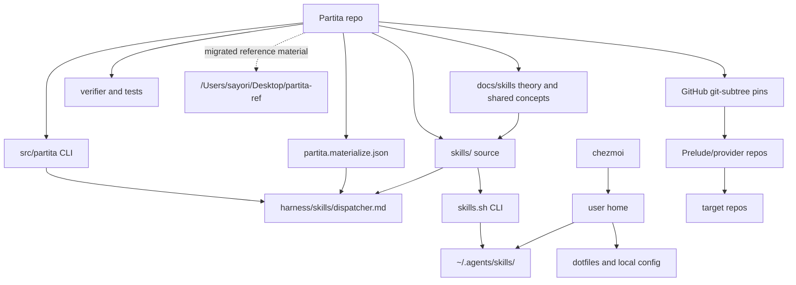

# Migration

## Target

Partita 的目标状态是 personal skill workflow/source harness。

Partita SHOULD own 自建或维护的 skill source、skill authoring workflow、materialization audit、pin、verification 和最小 skill runtime wrapper。

Partita MUST NOT own user-home dotfile materialization、global runtime skill universe、provider runtime、external skill collections、target-repo runtime copies 或 one-off workflow history。

chezmoi SHOULD own user-home mapping 和 dotfile materialization。

skills.sh CLI SHOULD own runtime skill install、list、remove 和 update。

Prelude/provider repos SHOULD own target project lifecycle 和 provider runtime。

External repositories SHOULD enter Partita only through GitHub git-subtree pins and their sibling `repos/<name>.subtree.json` contract.

第一阶段迁移对象是 implementation loop，不是 `/Users/sayori/Desktop/partita-ref` 里的旧 semantic content。

Partita SHOULD migrate in thin adapters and checks for the current loop:

| Loop segment | Owner | Partita surface |
| --- | --- | --- |
| Skill source update | Partita | `skills/`、`pnpm generate`、`pnpm verify` |
| Runtime skill install/update | skills.sh CLI | `partita skill sync`、`partita skill status`、`partita skill verify` |
| User-home materialization | chezmoi | `partita home status`、`partita home diff`、显式写入的 `partita home apply --write` |
| External pin | Partita + git subtree | `partita pin`、`repos/<name>.subtree.json` |

## Architecture

## Boundaries

`harness/skills/dispatcher.md` SHOULD remain only as a materialized skill inventory audit.

`harness/skills/dispatcher.md` MUST NOT become runtime governance, installer state, mapping layer, or durable knowledge layer.

`packages/wiki/` has been migrated out of Partita and MUST NOT be restored as an in-repo semantic layer.

`runtime/references/` has been migrated out of Partita and MUST NOT be restored without a concrete runtime consumer.

`docs/skills/` is the Partita-owned theory and shared concept source surface.

Shared concepts SHOULD be materialized from `docs/skills/concepts/` into skill-local `references/` so runtime skills remain self-contained.

`partita.materialize.json` SHOULD remain the only repo-local materialization config for clean copies and generated reports.

Materialized outputs MUST NOT contain old `partita:projection` or `routing-table` markers.

`.codex-plugin/` has been migrated out of Partita and MUST NOT be used to install duplicate `partita:<skill>` runtime copies.

`/Users/sayori/Desktop/partita-ref` is a quarantine/reference location, not a second source of truth.

Content MAY return from `/Users/sayori/Desktop/partita-ref` only after sayori confirms the specific rule or concept and it is rebuilt into a current Partita surface.

## Ownership classes

| Class | Meaning |
| --- | --- |
| `partita-core` | Partita keeps this as source, CLI, package, verification, or root operating surface. |
| `partita-skill-source` | Partita keeps this as self-owned skill source. |
| `partita-theory` | Partita keeps this as skill theory or shared concept source. |
| `partita-generated` | Partita may regenerate or materialize this; it is not source authority. |
| `wiki-external` | This should leave Partita or be folded into executable source before wiki removal. |
| `runtime-reference` | This is migration candidate unless a concrete runtime consumer remains. |
| `pin` | Partita keeps this as GitHub git-subtree pin contract or read-only upstream materialization. |
| `quarantine-ref` | This has moved to `/Users/sayori/Desktop/partita-ref` for reference only. |
| `external-tooling` | Ownership belongs to package managers, skills.sh CLI, chezmoi, or host tools. |
| `legacy-delete` | This should be deleted from Partita. |
| `decision-gate` | This requires sayori decision before keep, migrate, or delete. |

## File Ownership

This table covers every tracked path returned by `git ls-files` on 2026-07-01, plus this new module.

| Path | Owner | Action | Note |
| --- | --- | --- | --- |
| `.codex-plugin/plugin.json` | `quarantine-ref` | migrated | Moved to `/Users/sayori/Desktop/partita-ref/.codex-plugin/plugin.json`; plugin runtime metadata is not Partita core. |
| `.codex/effect-feedback/.gitkeep` | `legacy-delete` | delete | Old effect-harness runtime residue. |
| `.gitignore` | `partita-core` | keep | Repository hygiene. |
| `AGENTS.md` | `partita-core` | keep | Agent operating root map. |
| `CLAUDE.md` | `quarantine-ref` | migrated | Moved to `/Users/sayori/Desktop/partita-ref/CLAUDE.md`; tool-specific instruction file is not Partita core. |
| `CONTEXT.md` | `quarantine-ref` | migrated | Moved to `/Users/sayori/Desktop/partita-ref/CONTEXT.md`; old wiki root map is not Partita core. |
| `HARNESS.md` | `quarantine-ref` | migrated | Moved to `/Users/sayori/Desktop/partita-ref/HARNESS.md`; old wiki harness map is not Partita core. |
| `LICENSE` | `partita-core` | keep | Repository license. |
| `README.md` | `partita-core` | keep | Human entrypoint. |
| `MIGRATION.md` | `partita-core` | keep | Migration target and ownership audit. |
| `bin/partita.ts` | `partita-core` | keep | CLI entrypoint. |
| `docs/skills/concepts/case.md` | `partita-theory` | keep | Shared case concept source projected into skill-local references. |
| `docs/skills/theory.md` | `partita-theory` | keep | Current Partita skill theory and verification layers. |
| `eslint.config.mjs` | `partita-core` | keep | Lint configuration. |
| `harness/skills/checks.md` | `quarantine-ref` | migrated | Moved to `/Users/sayori/Desktop/partita-ref/harness/skills/checks.md`. |
| `harness/skills/dispatcher.md` | `partita-generated` | keep | Materialized skill inventory audit, not runtime router. |
| `harness/skills/family.md` | `quarantine-ref` | migrated | Moved to `/Users/sayori/Desktop/partita-ref/harness/skills/family.md`. |
| `harness/skills/policy.md` | `quarantine-ref` | migrated | Moved to `/Users/sayori/Desktop/partita-ref/harness/skills/policy.md`. |
| `harness/skills/routing.md` | `quarantine-ref` | migrated | Moved to `/Users/sayori/Desktop/partita-ref/harness/skills/routing.md`. |
| `harness/skills/shape.md` | `quarantine-ref` | migrated | Moved to `/Users/sayori/Desktop/partita-ref/harness/skills/shape.md`. |
| `knip.jsonc` | `partita-core` | keep | Dependency hygiene configuration. |
| `package.json` | `partita-core` | keep | Package scripts and workspace metadata. |
| `partita.materialize.json` | `partita-core` | keep | Repo-local clean copy and generated report config. |
| `packages/generic-projection/package.json` | `legacy-delete` | delete | Old helper package removed; materialization is Partita-specific generator/verifier behavior. |
| `packages/generic-projection/src/index.ts` | `legacy-delete` | delete | Old marker DSL and file-copy helper removed. |
| `packages/generic-projection/tsconfig.build.json` | `legacy-delete` | delete | Old helper build config removed. |
| `packages/generic-projection/tsconfig.json` | `legacy-delete` | delete | Old helper TypeScript config removed. |
| `packages/wiki/collaboration/context.md` | `quarantine-ref` | migrated | Collaboration semantic node. |
| `packages/wiki/collaboration/corrections.md` | `quarantine-ref` | migrated | Collaboration semantic node. |
| `packages/wiki/collaboration/index.md` | `quarantine-ref` | migrated | Wiki index node. |
| `packages/wiki/collaboration/instructions.md` | `quarantine-ref` | migrated | Collaboration semantic node. |
| `packages/wiki/collaboration/profile.md` | `quarantine-ref` | migrated | Collaboration semantic node. |
| `packages/wiki/collaboration/response.md` | `quarantine-ref` | migrated | Collaboration semantic node. |
| `packages/wiki/documentation/assertion.md` | `quarantine-ref` | migrated | Documentation preference node. |
| `packages/wiki/documentation/audience.md` | `quarantine-ref` | migrated | Documentation preference node. |
| `packages/wiki/documentation/boundary.md` | `quarantine-ref` | migrated | Documentation preference node. |
| `packages/wiki/documentation/index.md` | `quarantine-ref` | migrated | Wiki index node. |
| `packages/wiki/documentation/keywords.md` | `quarantine-ref` | migrated | Documentation preference node. |
| `packages/wiki/documentation/language.md` | `quarantine-ref` | migrated | Documentation preference node. |
| `packages/wiki/documentation/links.md` | `quarantine-ref` | migrated | Documentation preference node. |
| `packages/wiki/documentation/metadata.md` | `quarantine-ref` | migrated | Documentation preference node. |
| `packages/wiki/documentation/module.md` | `quarantine-ref` | migrated | Documentation preference node. |
| `packages/wiki/documentation/path.md` | `quarantine-ref` | migrated | Documentation preference node. |
| `packages/wiki/documentation/pattern.md` | `quarantine-ref` | migrated | Documentation preference node. |
| `packages/wiki/documentation/section.md` | `quarantine-ref` | migrated | Documentation preference node. |
| `packages/wiki/harness/action.md` | `quarantine-ref` | migrated | Harness semantic node. |
| `packages/wiki/harness/behavior.md` | `quarantine-ref` | migrated | Harness semantic node. |
| `packages/wiki/harness/context.md` | `quarantine-ref` | migrated | Harness semantic node. |
| `packages/wiki/harness/failure.md` | `quarantine-ref` | migrated | Harness semantic node. |
| `packages/wiki/harness/identity.md` | `quarantine-ref` | migrated | Harness semantic node. |
| `packages/wiki/harness/index.md` | `quarantine-ref` | migrated | Wiki index node. |
| `packages/wiki/harness/validation.md` | `quarantine-ref` | migrated | Harness semantic node. |
| `packages/wiki/index.md` | `quarantine-ref` | migrated | Wiki root index. |
| `packages/wiki/package.json` | `quarantine-ref` | migrated | Wiki package metadata. |
| `packages/wiki/practice/audit.md` | `quarantine-ref` | migrated | Practice semantic node. |
| `packages/wiki/practice/capture.md` | `quarantine-ref` | migrated | Practice semantic node. |
| `packages/wiki/practice/create.md` | `quarantine-ref` | migrated | Practice semantic node. |
| `packages/wiki/practice/gate.md` | `quarantine-ref` | migrated | Practice semantic node. |
| `packages/wiki/practice/index.md` | `quarantine-ref` | migrated | Wiki index node. |
| `packages/wiki/practice/patch.md` | `quarantine-ref` | migrated | Practice semantic node. |
| `packages/wiki/practice/verify.md` | `quarantine-ref` | migrated | Practice semantic node. |
| `packages/wiki/projection/generic.md` | `quarantine-ref` | migrated | Old wiki semantic node. |
| `packages/wiki/projection/index.md` | `quarantine-ref` | migrated | Old wiki index node. |
| `packages/wiki/projection/loss.md` | `quarantine-ref` | migrated | Old wiki semantic node. |
| `packages/wiki/projection/runtime.md` | `quarantine-ref` | migrated | Old wiki semantic node. |
| `packages/wiki/projection/verifier/description.md` | `quarantine-ref` | migrated | Old verifier semantic node. |
| `packages/wiki/projection/verifier/index.md` | `quarantine-ref` | migrated | Old wiki index node. |
| `packages/wiki/projection/verifier/links.md` | `quarantine-ref` | migrated | Old verifier semantic node. |
| `packages/wiki/projection/verifier/metadata.md` | `quarantine-ref` | migrated | Old verifier semantic node. |
| `packages/wiki/projection/verifier/nodes.md` | `quarantine-ref` | migrated | Old verifier semantic node. |
| `packages/wiki/projection/verifier/shape.md` | `quarantine-ref` | migrated | Old verifier semantic node. |
| `packages/wiki/skill/activation.md` | `quarantine-ref` | migrated | Skill semantic node. |
| `packages/wiki/skill/boundary.md` | `quarantine-ref` | migrated | Skill semantic node. |
| `packages/wiki/skill/case/capture.md` | `quarantine-ref` | migrated | Skill case semantic node. |
| `packages/wiki/skill/case/index.md` | `quarantine-ref` | migrated | Wiki index node. |
| `packages/wiki/skill/case/insufficient-material.md` | `quarantine-ref` | migrated | Skill case semantic node. |
| `packages/wiki/skill/case/patch.md` | `quarantine-ref` | migrated | Skill case semantic node. |
| `packages/wiki/skill/case/pattern.md` | `quarantine-ref` | migrated | Skill case semantic node. |
| `packages/wiki/skill/case/pressure-reading.md` | `quarantine-ref` | migrated | Skill case semantic node. |
| `packages/wiki/skill/case/pressure.md` | `quarantine-ref` | migrated | Skill case semantic node. |
| `packages/wiki/skill/duration.md` | `quarantine-ref` | migrated | Skill semantic node. |
| `packages/wiki/skill/effects.md` | `quarantine-ref` | migrated | Skill semantic node. |
| `packages/wiki/skill/governance/action.md` | `quarantine-ref` | migrated | Skill governance semantic node. |
| `packages/wiki/skill/governance/family.md` | `quarantine-ref` | migrated | Skill governance semantic node. |
| `packages/wiki/skill/governance/identity.md` | `quarantine-ref` | migrated | Skill governance semantic node. |
| `packages/wiki/skill/governance/index.md` | `quarantine-ref` | migrated | Wiki index node. |
| `packages/wiki/skill/governance/split.md` | `quarantine-ref` | migrated | Skill governance semantic node. |
| `packages/wiki/skill/index.md` | `quarantine-ref` | migrated | Wiki index node. |
| `packages/wiki/skill/invocation.md` | `quarantine-ref` | migrated | Skill semantic node. |
| `packages/wiki/skill/lifecycle/close.md` | `quarantine-ref` | migrated | Skill lifecycle semantic node. |
| `packages/wiki/skill/lifecycle/handle.md` | `quarantine-ref` | migrated | Skill lifecycle semantic node. |
| `packages/wiki/skill/lifecycle/index.md` | `quarantine-ref` | migrated | Wiki index node. |
| `packages/wiki/skill/lifecycle/marker.md` | `quarantine-ref` | migrated | Skill lifecycle semantic node. |
| `packages/wiki/skill/lifecycle/mode.md` | `quarantine-ref` | migrated | Skill lifecycle semantic node. |
| `packages/wiki/skill/orchestrator.md` | `quarantine-ref` | migrated | Skill semantic node. |
| `packages/wiki/skill/primitive.md` | `quarantine-ref` | migrated | Skill semantic node. |
| `packages/wiki/skill/rule.md` | `quarantine-ref` | migrated | Skill semantic node. |
| `packages/wiki/skill/validation-locality.md` | `quarantine-ref` | migrated | Skill semantic node. |
| `packages/wiki/vocabulary/assertion.md` | `quarantine-ref` | migrated | Vocabulary node. |
| `packages/wiki/vocabulary/index.md` | `quarantine-ref` | migrated | Wiki index node. |
| `packages/wiki/vocabulary/projection.md` | `quarantine-ref` | migrated | Old vocabulary node. |
| `packages/wiki/vocabulary/runtime.md` | `quarantine-ref` | migrated | Vocabulary node. |
| `packages/wiki/vocabulary/skill.md` | `quarantine-ref` | migrated | Vocabulary node. |
| `packages/wiki/vocabulary/workflow.md` | `quarantine-ref` | migrated | Vocabulary node. |
| `packages/wiki/workflow/gate/asset.md` | `quarantine-ref` | migrated | Workflow gate semantic node. |
| `packages/wiki/workflow/gate/case.md` | `quarantine-ref` | migrated | Workflow gate semantic node. |
| `packages/wiki/workflow/gate/contract.md` | `quarantine-ref` | migrated | Workflow gate semantic node. |
| `packages/wiki/workflow/gate/exit.md` | `quarantine-ref` | migrated | Workflow gate semantic node. |
| `packages/wiki/workflow/gate/handoff.md` | `quarantine-ref` | migrated | Workflow gate semantic node. |
| `packages/wiki/workflow/gate/index.md` | `quarantine-ref` | migrated | Wiki index node. |
| `packages/wiki/workflow/gate/optional.md` | `quarantine-ref` | migrated | Workflow gate semantic node. |
| `packages/wiki/workflow/gate/span.md` | `quarantine-ref` | migrated | Workflow gate semantic node. |
| `packages/wiki/workflow/index.md` | `quarantine-ref` | migrated | Wiki index node. |
| `packages/wiki/workflow/orchestration.md` | `quarantine-ref` | migrated | Workflow semantic node. |
| `packages/wiki/workflow/workflow.md` | `quarantine-ref` | migrated | Workflow semantic node. |
| `pnpm-lock.yaml` | `external-tooling` | keep | Package manager lockfile. |
| `pnpm-workspace.yaml` | `partita-core` | keep | Workspace definition. |
| `runtime/references/skill/case.md` | `quarantine-ref` | migrated | Moved to `/Users/sayori/Desktop/partita-ref/runtime/references/skill/case.md`. |
| `runtime/references/skill/patch.md` | `quarantine-ref` | migrated | Moved to `/Users/sayori/Desktop/partita-ref/runtime/references/skill/patch.md`. |
| `runtime/references/skill/shape.md` | `quarantine-ref` | migrated | Moved to `/Users/sayori/Desktop/partita-ref/runtime/references/skill/shape.md`. |
| `runtime/references/target/openai/metadata.md` | `quarantine-ref` | migrated | Moved to `/Users/sayori/Desktop/partita-ref/runtime/references/target/openai/metadata.md`. |
| `runtime/references/target/openai/resources.md` | `quarantine-ref` | migrated | Moved to `/Users/sayori/Desktop/partita-ref/runtime/references/target/openai/resources.md`. |
| `runtime/references/target/openai/shape.md` | `quarantine-ref` | migrated | Moved to `/Users/sayori/Desktop/partita-ref/runtime/references/target/openai/shape.md`. |
| `runtime/references/target/openai/validation.md` | `quarantine-ref` | migrated | Moved to `/Users/sayori/Desktop/partita-ref/runtime/references/target/openai/validation.md`. |
| `runtime/references/workflow/case.md` | `quarantine-ref` | migrated | Moved to `/Users/sayori/Desktop/partita-ref/runtime/references/workflow/case.md`. |
| `runtime/references/workflow/shape.md` | `quarantine-ref` | migrated | Moved to `/Users/sayori/Desktop/partita-ref/runtime/references/workflow/shape.md`. |
| `skills/expression/density/SKILL.md` | `partita-skill-source` | keep | Self-owned expression skill. |
| `skills/expression/density/agents/openai.yaml` | `partita-skill-source` | keep | Skill runtime metadata source. |
| `skills/expression/density/references/examples.md` | `partita-skill-source` | keep | Skill-local reference. |
| `skills/expression/density/references/protocol.md` | `partita-skill-source` | keep | Skill-local reference. |
| `skills/expression/density/references/symbols.md` | `partita-skill-source` | keep | Skill-local reference. |
| `skills/link/pin/SKILL.md` | `partita-skill-source` | keep | GitHub git-subtree pin skill. |
| `skills/link/pin/agents/openai.yaml` | `partita-skill-source` | keep | Skill runtime metadata source. |
| `skills/maintenance/reconcile/SKILL.md` | `partita-skill-source` | keep | Self-owned maintenance skill. |
| `skills/maintenance/reconcile/agents/openai.yaml` | `partita-skill-source` | keep | Skill runtime metadata source. |
| `skills/orientation/aim/SKILL.md` | `partita-skill-source` | keep | Self-owned orientation skill. |
| `skills/orientation/aim/agents/openai.yaml` | `partita-skill-source` | keep | Skill runtime metadata source. |
| `skills/orientation/aim/references/cases.md` | `partita-skill-source` | keep | Skill-local reference. |
| `skills/orientation/argue/SKILL.md` | `partita-skill-source` | keep | Self-owned orientation skill. |
| `skills/orientation/argue/agents/openai.yaml` | `partita-skill-source` | keep | Skill runtime metadata source. |
| `skills/orientation/baseline/SKILL.md` | `partita-skill-source` | keep | Self-owned orientation skill. |
| `skills/orientation/baseline/agents/openai.yaml` | `partita-skill-source` | keep | Skill runtime metadata source. |
| `skills/orientation/land/SKILL.md` | `partita-skill-source` | keep | Self-owned orientation skill. |
| `skills/orientation/land/agents/openai.yaml` | `partita-skill-source` | keep | Skill runtime metadata source. |
| `skills/primitive/conduct/SKILL.md` | `partita-skill-source` | keep | Self-owned primitive skill. |
| `skills/primitive/conduct/agents/openai.yaml` | `partita-skill-source` | keep | Skill runtime metadata source. |
| `skills/primitive/conduct/references/case.md` | `partita-generated` | keep | Skill-local materialized copy of shared case concept. |
| `skills/primitive/conduct/references/insufficient-material.md` | `partita-skill-source` | keep | Skill-local reference. |
| `skills/primitive/conduct/references/openai-skill.md` | `partita-skill-source` | keep | Skill-local reference. |
| `skills/primitive/conduct/references/partita-skill.md` | `partita-skill-source` | keep | Skill-local reference. |
| `skills/primitive/conduct/references/workflow-creation.md` | `partita-skill-source` | keep | Skill-local reference. |
| `skills/primitive/notate/SKILL.md` | `partita-skill-source` | keep | Self-owned primitive skill. |
| `skills/primitive/notate/agents/openai.yaml` | `partita-skill-source` | keep | Skill runtime metadata source. |
| `skills/primitive/notate/references/case.md` | `partita-generated` | keep | Skill-local materialized copy of shared case concept. |
| `skills/primitive/notate/references/insufficient-material.md` | `partita-skill-source` | keep | Skill-local reference. |
| `skills/primitive/notate/references/openai-skill.md` | `partita-skill-source` | keep | Skill-local reference. |
| `skills/primitive/notate/references/partita-skill.md` | `partita-skill-source` | keep | Skill-local reference. |
| `skills/primitive/notate/references/skill-creation.md` | `partita-skill-source` | keep | Skill-local reference. |
| `skills/primitive/retune/SKILL.md` | `partita-skill-source` | keep | Self-owned primitive skill. |
| `skills/primitive/retune/agents/openai.yaml` | `partita-skill-source` | keep | Skill runtime metadata source. |
| `skills/primitive/retune/references/case.md` | `partita-generated` | keep | Skill-local materialized copy of shared case concept. |
| `skills/primitive/retune/references/insufficient-material.md` | `partita-skill-source` | keep | Skill-local reference. |
| `skills/primitive/retune/references/openai-skill.md` | `partita-skill-source` | keep | Skill-local reference. |
| `skills/primitive/retune/references/partita-skill.md` | `partita-skill-source` | keep | Skill-local reference. |
| `skills/primitive/retune/references/skill-patch.md` | `partita-skill-source` | keep | Skill-local reference. |
| `skills/primitive/retune/references/runtime-copy-case.md` | `partita-skill-source` | keep | Skill-local recurrence case reference. |
| `skills/primitive/score/SKILL.md` | `partita-skill-source` | keep | Self-owned primitive skill. |
| `skills/primitive/score/agents/openai.yaml` | `partita-skill-source` | keep | Skill runtime metadata source. |
| `skills/primitive/score/references/assertion.md` | `partita-skill-source` | keep | Skill-local reference. |
| `skills/primitive/score/references/audience.md` | `partita-skill-source` | keep | Skill-local reference. |
| `skills/primitive/score/references/boundary.md` | `partita-skill-source` | keep | Skill-local reference. |
| `skills/primitive/score/references/keywords.md` | `partita-skill-source` | keep | Skill-local reference. |
| `skills/primitive/score/references/language.md` | `partita-skill-source` | keep | Skill-local reference. |
| `skills/primitive/score/references/links.md` | `partita-skill-source` | keep | Skill-local reference. |
| `skills/primitive/score/references/metadata.md` | `partita-skill-source` | keep | Skill-local reference. |
| `skills/primitive/score/references/module.md` | `partita-skill-source` | keep | Skill-local reference. |
| `skills/primitive/score/references/path.md` | `partita-skill-source` | keep | Skill-local reference. |
| `skills/primitive/score/references/pattern.md` | `partita-skill-source` | keep | Skill-local reference. |
| `skills/primitive/score/references/section.md` | `partita-skill-source` | keep | Skill-local reference. |
| `src/cli/Main.ts` | `partita-core` | keep | Effect CLI program and command surface. |
| `src/partita/errors.ts` | `partita-core` | keep | Partita error model. |
| `src/partita/frontmatter.ts` | `partita-core` | keep | Skill frontmatter parser. |
| `src/partita/generator.ts` | `partita-core` | keep | Materialization generator. |
| `src/partita/home.ts` | `partita-core` | keep | Thin chezmoi home materialization wrapper. |
| `src/partita/skill.ts` | `partita-core` | keep | Thin skills.sh skill runtime wrapper. |
| `src/partita/model.ts` | `partita-core` | keep | Partita domain model. |
| `src/partita/openai-skill-validation.ts` | `partita-core` | keep | OpenAI/Codex runtime skill validation. |
| `src/partita/partita-skill-validation.ts` | `partita-core` | keep | Partita source skill contract validation. |
| `src/partita/pin.ts` | `partita-core` | keep | GitHub git-subtree pin logic. |
| `src/partita/validation.ts` | `partita-core` | keep | Shared validation report model. |
| `src/partita/verifier.ts` | `partita-core` | keep | Repository verifier. |
| `tests/generator.test.ts` | `partita-core` | keep | Generator tests. |
| `tests/home.test.ts` | `partita-core` | keep | Chezmoi home wrapper tests. |
| `tests/skill.test.ts` | `partita-core` | keep | Skill runtime wrapper tests. |
| `tests/openai-skill-validation.test.ts` | `partita-core` | keep | OpenAI runtime skill validation tests. |
| `tests/pin.test.ts` | `partita-core` | keep | Pin tests. |
| `tests/verifier.test.ts` | `partita-core` | keep | Verifier tests. |
| `tsconfig.build.json` | `partita-core` | keep | Build TypeScript config. |
| `tsconfig.json` | `partita-core` | keep | TypeScript config. |
| `turbo.json` | `partita-core` | keep | Turbo task config. |

## Future Pins

| Future path | Owner | Action | Note |
| --- | --- | --- | --- |
| `repos/<name>.subtree.json` | `pin` | keep | GitHub git-subtree pin contract and source truth for the pinned external repo. |
| `repos/<name>/` | `pin` | materialize read-only | External upstream subtree materialization; not Partita-owned skill source and not provider runtime. |
| `repos/<name>/LLMS.md` or equivalent anchor | `pin` | read-only | Agent-readable upstream anchor, governed by the sibling contract. |

## Decisions

| Question | Default answer |
| --- | --- |
| Should dispatcher stay? | Yes, only as materialized skill inventory audit. |
| Should wiki stay? | No, it has been migrated to `/Users/sayori/Desktop/partita-ref`. |
| Should old helper package stay? | No, it has been removed. Turbo/pnpm workspace stays for future packages. |
| Should runtime references stay? | No, they have been migrated to `/Users/sayori/Desktop/partita-ref`. |
| Should `.codex-plugin` stay? | No, it has been migrated to `/Users/sayori/Desktop/partita-ref`. |
| Should global runtime skills be written by Partita? | No, skills.sh CLI owns runtime install state. |
| Should user-home mapping be written by Partita? | No, chezmoi owns user-home mapping. |
